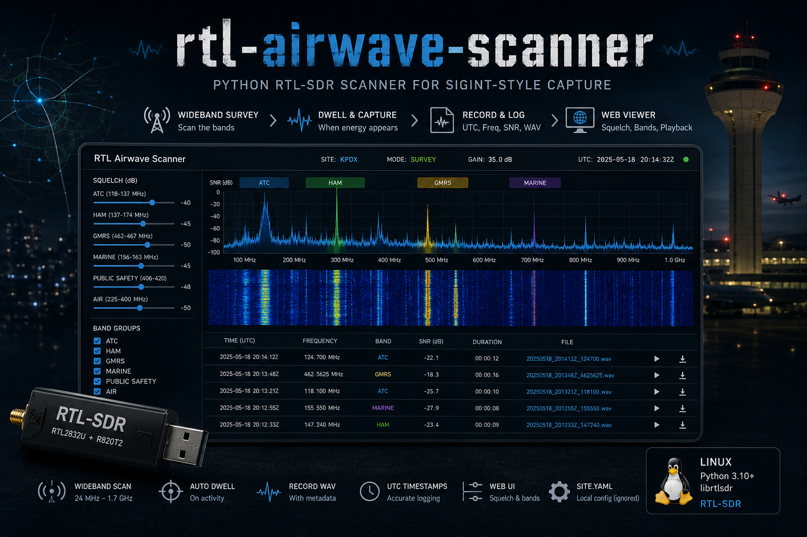

# rtl-airwave-scanner



Python RTL-SDR scanner for **SIGINT-style** capture:

- Wideband survey + dwell when energy appears
- Records **UTC time, frequency, SNR, audio WAV**
- Web viewer with **squelch sliders** and **band group toggles** (ATC / ham / GMRS / …)
- Site-specific ATC, AWOS ignores, and local repeaters live in **`site.yaml`** (not committed)
- **Multi-dongle + multi-threading** — one process can drive several RTL-SDRs in parallel (each stick has its own hop worker and USB IQ reader thread)
- Audio **retention** — zip WAVs after 12 h, delete archives after 72 h

## Requirements

- Linux
- RTL-SDR dongle (RTL2832U + R820T/R820T2, etc.)
- Python 3.10+
- `librtlsdr` (`sudo apt install librtlsdr0` or build from osmocom)

Blacklist kernel DVB modules if the stick is claimed as a TV tuner (see project notes / distro docs).

## Quick start

```bash
git clone https://github.com/Bobpick/rtl-airwave-scanner.git
cd rtl-airwave-scanner

python3 -m venv .venv
.venv/bin/pip install -r requirements.txt

# Base config (generic)
cp config.example.yaml config.yaml

# YOUR location: ATC freqs, local repeater, AWOS to ignore
cp site.example.yaml site.yaml
# edit site.yaml

./run.sh          # scanner
./view.sh         # http://127.0.0.1:8765/
```

## Site config (`site.yaml`)

Keep personal/airport data out of the main config:

| Field | Purpose |
|--------|---------|
| `known_channels` | Labels (CTAF, approach, your repeater) |
| `bands` | Extra priority scan windows |
| `ignored_frequencies_hz` | AWOS / birdies never to record |

Base file: `config.yaml` (or `config.example.yaml`).  
Overlay: `site.yaml` (gitignored). Template: `site.example.yaml`.

Frequencies are **Hz** (`122.725 MHz` → `122725000`).

## Band groups (viewer)

| Toggle | Typical content |
|--------|------------------|
| **ATC** | 118–137 MHz AM (off by default) |
| **Ham** | 10 m, 6 m, 2 m, 1.25 m, **full 70 cm (420–450)**, 33 cm, 23 cm |
| **GMRS/FRS** | Full US GMRS/FRS table |
| **MURS** | MURS |
| **Marine** | Marine VHF |

Toggles and squelch apply live via `squelch.json`.

### Why not the entire 25–1750 MHz continuum?

An RTL-SDR look is only **~2 MHz** wide at 2.048 Msps. Scanning “everything” would mean **hundreds** of hop windows and a very long revisit time. The default plan covers **allocations that usually carry voice/local traffic** inside the stick’s range (including **10 m through 23 cm** ham), not empty ISM/TV dead space. More windows = longer full hop cycle; idle hops stay fast.

**12 m (24.89–24.99 MHz)** is below most R820T sticks — not scanned.

## Multi-dongle and multi-threading

A single scanner process can use **one or more** RTL-SDR sticks. More sticks mean **shorter revisit time** (e.g. 2 m/GMRS on one radio while ATC hops on another).

### How threading works

| Thread | Role |
|--------|------|
| **Main** | Starts workers, handles SIGINT/SIGTERM, process lock |
| **Radio worker** (one per dongle) | Hop schedule, FFT/peaks, RF arming, demod, finalize clips |
| **IQ reader** (one per dongle) | Continuous USB sample ingest so DSP never starves librtlsdr |

Shared across workers (thread-safe):

- `recordings/transmissions.db` + `.csv` + WAVs  
- `live_state.json` (spectrum from the most recent radio; `radios[]` lists every stick’s band/mode)

With **one** stick and no `device.radios:` list, you still get the async IQ reader + main worker (same as before). Multi-dongle only adds more worker/reader pairs.

### How to add a second (or third) dongle

1. **Plug in** the new RTL-SDR (powered USB hub recommended if the bus is weak).
2. **List devices** and copy serials:

   ```bash
   cd ~/rtl-airwave-scanner
   .venv/bin/python -m scanner --list-devices
   ```

   Example output:

   ```text
   Found 2 RTL-SDR device(s):
     #0 serial=00000001
     #1 serial=00000002
   ```

   If both serials are blank or identical, set unique ones with `rtl_eeprom` (or use `device_index` instead of `serial`).

3. **Edit `config.yaml`** under `device:` — add a `radios:` list (also documented in `config.example.yaml`):

   ```yaml
   device:
     sample_rate_hz: 2048000
     gain: 40.2
     ppm_error: 0
     radios:
       - label: voice
         serial: "00000001"    # from --list-devices
         groups: [ham_2m, ham_70cm, gmrs, murs, marine, ham_1p25m]
       - label: atc
         serial: "00000002"
         groups: [atc, ham_10m, ham_6m, ham_33cm, ham_23cm]
   ```

   - `label` — short name in logs and clip notes (`radio=voice`).
   - `serial` — preferred bind; use `null` to auto-pick the next free stick.
   - `device_index` — optional alternative to serial (`0`, `1`, …).
   - `groups` — band groups this stick hops (must match groups used in `bands:` / the viewer toggles).
   - Per-radio `gain` / `ppm_error` override the global device values if set.

4. **Restart** the scanner (`./run.sh` or Shutdown in the UI, then start again).

5. **Confirm** in the log:

   ```text
   Multi-dongle: starting 2 radio worker(s)
   [voice] RTL-SDR ready: ...
   [atc] RTL-SDR ready: ...
   [voice] plan: N windows · groups ham_2m,ham_70cm,...
   [atc] plan: M windows · groups atc,...
   ```

### Defaults and tips

- **No `radios:`** → single dongle, all enabled band groups (legacy path).
- **Two+ radios with no `groups`** → automatic split: VHF voice nets on the first stick, ATC + wider/microwave groups on the second.
- **Unassigned groups** (not listed on any radio) are still scanned: they are shared across radios that have no `groups`, or round-robined if every radio has an explicit list.
- Prefer **explicit serials** once you have two sticks so reboot order does not swap roles.
- One process only: the scanner lock prevents two scanner instances from fighting the same dongles.
- Third stick: add another `radios:` entry with its own `label`, `serial`, and `groups`.

## Output

| Path | Content |
|------|---------|
| `recordings/*.wav` | Recent audio (kept loose for ~12 hours) |
| `recordings/archive/*.wav.zip` | Zipped audio (12–72 hours old) |
| `recordings/transmissions.db` | SQLite log |
| `recordings/transmissions.csv` | CSV log |

**Retention (default):** after **12 hours** each WAV is zipped under `recordings/archive/`; after **72 hours** the archive is deleted. DB metadata stays. Override in `config.yaml` → `output.zip_after_hours` / `delete_after_hours`. Manual pass:

```bash
.venv/bin/python -m scanner.retention -c config.yaml
```

## License

MIT (see `LICENSE`).

## Legal

Receive only where lawful. Authors are not responsible for misuse.

## Desktop launcher (no terminal)

```bash
./start-background.sh     # scanner + viewer in background, opens browser
```

Or search **RTL Airwave Scanner** in your app menu.

- **Shutdown** from the red **Shutdown** button in the web UI (stops scanner + dashboard).
- Logs: `logs/scanner.log`, `logs/viewer.log`.

### AppImage?

Possible later, but heavy for Python + USB. A `.desktop` launcher is the usual Linux approach.
